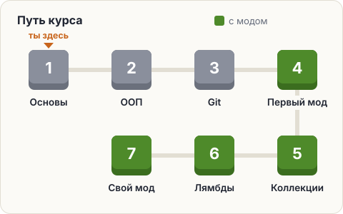
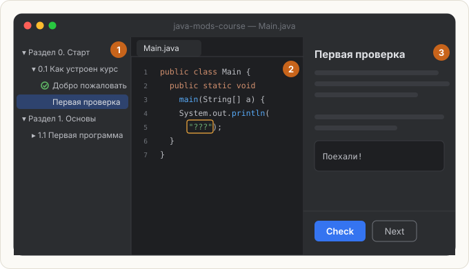

# Добро пожаловать

Это курс по Java с полного нуля. Цель — дойти до **своих модов для Minecraft**,
а заодно получить базу, с которой потом легко перейти на Kotlin и Android.

Здесь нет видео. Только текст, схемы и задачи. Каждый шаг устроен одинаково:
коротко объясняем идею — сразу закрепляем её в коде — программа сама проверяет решение.

## Как устроено окно

Курс живёт прямо в IntelliJ IDEA. Окно разделено на три зоны:

1. **Дерево курса** слева — разделы, уроки и шаги. Решённые шаги отмечаются зелёной галочкой.
2. **Редактор** в центре — здесь пишешь код. Обычно открыт файл `Main.java`.
3. **Панель задания** справа — то, что ты сейчас читаешь. Внизу у неё кнопки:
   - **Check** — проверить решение;
   - **Next** — перейти к следующему шагу (у теории вместо Check сразу Next).

## Какие бывают шаги

| Шаг | Что делать |
|---|---|
| 📖 **Теория** | Прочитать, по желанию запустить пример кода и поиграть с ним |
| ❓ **Вопрос** | Выбрать правильный вариант в панели и нажать **Check** |
| 🛠 **Задача** | Написать код в редакторе и нажать **Check** — тесты проверят результат |

## Если застрял

- Внутри задач есть свёрнутые **подсказки** — открывай их, когда пробуешь, а не сразу.
- Перечитай текст ошибки после **Check**: курс пишет, *какая строка* отличается и *что ожидалось*.
- Можно в любой момент запустить свою программу и посмотреть, что она печатает.

Внутри подсказки — наводка или кусочек решения. Чем меньше подсказок открыто,
тем лучше запоминается. Но застревать на час тоже не надо: открыл, понял, пошёл дальше.

В редакторе уже открыт пример программы. Пока просто посмотри на неё —
что там написано, разберём в Разделе 1. Жми **Next**.

<!-- preview: print — программа показана заранее, разбираем её в уроке 1.1 -->
