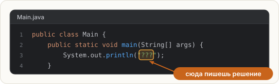

# Первая проверка

Попробуем, как работает кнопка **Check**, — пока без всякой теории.

В редакторе открыт `Main.java`. В нём есть **выделенная область** с текстом `"???"`.
Такие области — места, где от тебя ждут решения. Остальной код уже готов.



## Задание

Замени `???` на слово `Поехали!`, чтобы программа напечатала:

```text
Поехали!
```

Кавычки вокруг слова оставь — они нужны. Потом нажми **Check**.

<div class="hint" title="Как должна выглядеть строка целиком">

```java
System.out.println("Поехали!");
```

Восклицательный знак тоже часть ответа: проверка сравнивает текст символ в символ.
</div>

## Что будет после Check

- **Зелёное сообщение** — шаг засчитан, слева появилась галочка.
- **Красное сообщение** — курс напишет, что именно не совпало. Попробуй, например,
  написать `поехали` с маленькой буквы и нажать **Check** — посмотри, как выглядит ошибка.
