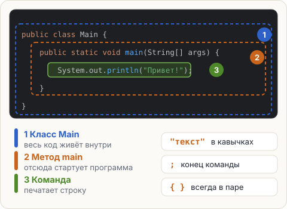
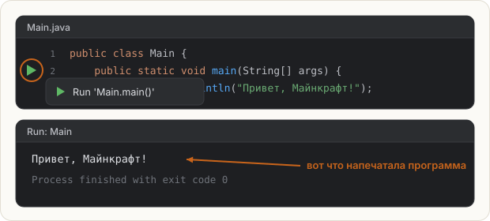

# Из чего состоит программа

Программа — это список команд для компьютера. Компьютер не догадывается и не додумывает:
он выполняет ровно то, что написано, **сверху вниз, по одной команде**.

Вот самая короткая полезная программа на Java. Она же открыта у тебя в редакторе:

```java
public class Main {
    public static void main(String[] args) {
        System.out.println("Привет, Майнкрафт!");
    }
}
```

Она печатает одну строку: `Привет, Майнкрафт!`. Разберём её по частям.



## Три слоя, как матрёшка

**1. Класс** `public class Main { ... }` — внешняя коробка. В Java весь код обязан лежать
внутри какого-нибудь класса. Имя класса (`Main`) должно совпадать с именем файла (`Main.java`).

**2. Метод** `main` — точка входа. Когда ты запускаешь программу, Java ищет именно
метод с названием `main` и начинает выполнять команды, которые лежат внутри него.
Это как кнопка «Играть» в меню: всё начинается отсюда.

**3. Команды** — то, что программа реально делает. Сейчас команда одна:
`System.out.println(...)` — напечатать текст и перейти на новую строку.

<div class="hint" title="А что значат public static void и String[] args?">

Честно: пока не важно. Эти слова понадобятся, когда дойдём до методов и классов
(уроки 1.9 и раздел 2). До тех пор относись к первым двум строкам как к готовой «шапке»,
которую пишем всегда одинаково. В IntelliJ её можно не набирать руками:
напиши `psvm` и нажми **Tab** — IDE развернёт заготовку метода `main`.
</div>

## Правила, о которые спотыкаются все

| Правило | Пример |
|---|---|
| Текст пишется **в двойных кавычках** | `"Привет"` — текст; `Привет` без кавычек — ошибка |
| Команда заканчивается **точкой с запятой** | `System.out.println("Привет");` |
| Каждая открытая **фигурная скобка** должна закрыться | `{` … `}` — как блоки в паре |
| **Регистр важен** | `System` ≠ `system`, `Main` ≠ `main` |

Отступы (пробелы в начале строк) Java не нужны — они для людей, чтобы было видно
вложенность. IntelliJ расставляет их сама: **&shortcut:ReformatCode;** выравнивает весь файл.

## Как запустить

Слева от строки `public static void main` есть **зелёный треугольник**. Нажми на него и выбери
**Run 'Main.main()'**. Внизу откроется окно **Run** — там появится всё, что напечатала программа.



## Попробуй

1. Запусти программу и найди вывод в окне **Run**.
2. Добавь под первой командой ещё одну такую же, но со своим текстом — и запусти снова.
3. Убери точку с запятой в конце строки и посмотри, как IntelliJ подчеркнёт ошибку красным.
   Верни точку с запятой.

Это шаг-теория — ничего проверять не нужно. Жми **Next**.

<script src="../../../lesson-kit/kit.js"></script>
