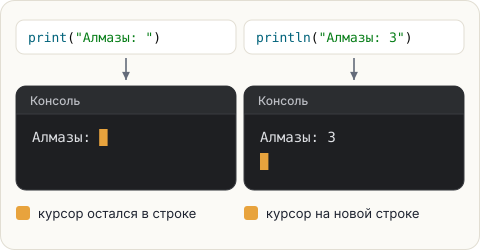

# print и println

У команды печати есть два варианта. Разница — в одной маленькой детали: **куда встаёт курсор
после печати**.

- `System.out.println("текст")` — печатает текст и **переводит курсор на новую строку**.
  `ln` в конце — от слова *line*, «строка».
- `System.out.print("текст")` — печатает текст, а **курсор остаётся там же**, сразу после
  последнего символа. Следующая печать продолжит ту же строку.



## Пример

```java
System.out.print("Алмазы: ");
System.out.println("3");
System.out.print("Железо: ");
System.out.print("12");
System.out.println();
System.out.println("Готово!");
```

Вывод:

<pre class="k-console">Алмазы: 3
Железо: 12
Готово!</pre>

Разберём, что произошло:

1. `print("Алмазы: ")` — напечатали, курсор остался в конце строки.
2. `println("3")` — дописали `3` в ту же строку и перешли на новую.
3. `print("Железо: ")` и `print("12")` — оба кусочка в одной строке.
4. `println()` **без текста** — ничего не печатает, просто переводит строку.
5. `println("Готово!")` — новая строка.

<div class="hint" title="Зачем нужен пробел в «Алмазы: »?">

Java не ставит пробелы сама. Если написать `print("Алмазы:")` без пробела,
получится `Алмазы:3`. Пробел — такой же символ, как буква, и его надо напечатать явно.
</div>

## Текст и числа

В скобки можно передать не только текст в кавычках, но и число — без кавычек:

```java
System.out.println("32 + 32");  // напечатает: 32 + 32
System.out.println(32 + 32);    // напечатает: 64
```

Всё, что после `//`, — комментарий: пояснение для человека, Java его пропускает.
Подробнее о комментариях — в конце урока.

В кавычках — это просто символы, Java печатает их как есть.
Без кавычек — это выражение, Java **сначала вычисляет** его, потом печатает результат.
Подробно про числа — в уроке 1.3.

## Попробуй

Пример из этого шага уже лежит в редакторе. Запусти его, а потом поменяй местами `print` и
`println` в паре строк и угадай вывод **до** запуска.

<!-- preview: arith — 32 + 32 как тизер; числа подробно в уроках 1.2–1.3 -->

<script src="../../../lesson-kit/kit.js"></script>
