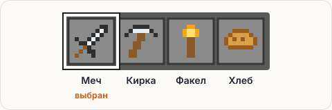

# Задача: хотбар

Нарисуем в консоли панель быстрого доступа — хотбар. Программа должна напечатать:

<pre class="k-console">[Меч] [Кирка] [Факел] [Хлеб]
Выбран слот 1: Меч</pre>



## Условие

- Первую строку собери **из четырёх команд `print`** — по одной на каждый предмет.
- Вторую строку напечатай одной командой `println`.

Проверка сравнит вывод и заодно посчитает, сколько в коде команд `print`.

<div class="hint" title="Между предметами слипаются скобки">

Если получается `[Меч][Кирка]`, значит, не хватает пробелов. Добавь пробел в конец текста:
`print("[Меч] ")`.
</div>

<div class="hint" title="Вторая строка прилипла к первой">

После последнего `print` курсор всё ещё стоит в первой строке. Переведи строку
пустой командой `System.out.println();` — она ничего не печатает, только переносит курсор.
</div>

<div class="hint" title="Решение целиком">

```java
System.out.print("[Меч] ");
System.out.print("[Кирка] ");
System.out.print("[Факел] ");
System.out.print("[Хлеб]");
System.out.println();
System.out.println("Выбран слот 1: Меч");
```
</div>

<script src="../../../lesson-kit/kit.js"></script>
