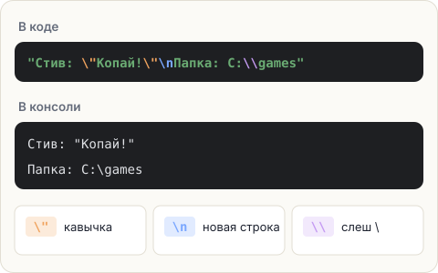

# Особые символы в строках

## Проблема с кавычками

Допустим, нужно напечатать фразу в кавычках: `Стив сказал: "Привет!"`.
Попробуем в лоб:

```java
System.out.println("Стив сказал: "Привет!"");   // ошибка!
```

Java читает текст до **первой** закрывающей кавычки. Для неё строка закончилась на
`"Стив сказал: "`, а дальше идёт непонятное `Привет!` — и программа не скомпилируется.

## Обратный слеш — «следующий символ особенный»

Чтобы вставить в текст символ, который иначе сломал бы строку, перед ним ставят
**обратный слеш** `\`. Пара «слеш + символ» называется **экранированием**:

| Пишешь в коде | Получаешь в выводе |
|---|---|
| `\"` | кавычку `"` |
| `\\` | один обратный слеш `\` |
| `\n` | перевод строки — как будто нажали Enter |
| `\t` | табуляцию — большой отступ |



Примеры:

```java
System.out.println("Стив сказал: \"Привет!\"");
// Стив сказал: "Привет!"

System.out.println("Первая строка\nВторая строка");
// Первая строка
// Вторая строка

System.out.println("Папка: C:\\games");
// Папка: C:\games
```

<div class="hint" title="Почему для слеша нужно два слеша?">

Одиночный `\` Java воспринимает как начало особой пары и смотрит на следующий символ.
`\g` — такой пары нет, будет ошибка. Поэтому сам слеш тоже экранируют: `\\`.
</div>

## Задача

С помощью **одной-единственной команды `println`** напечатай три строки:

<pre class="k-console">Табличка у шахты:
"Не копай прямо вниз!"
Мир лежит в C:\minecraft\saves</pre>

Использовать `print` и несколько `println` нельзя — только переводы строки `\n` внутри текста.

<div class="hint" title="С чего начать">

Сначала собери текст целиком в одну строку, вставив `\n` там, где должен быть перенос.
Потом пройдись по нему и замени каждую `"` внутри текста на `\"`, а каждый `\` на `\\`.
</div>

<div class="hint" title="Решение целиком">

```java
System.out.println("Табличка у шахты:\n\"Не копай прямо вниз!\"\nМир лежит в C:\\minecraft\\saves");
```
</div>

<script src="../../../lesson-kit/kit.js"></script>
