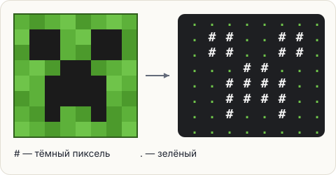

# Задача: пиксель-арт крипера

Лицо крипера — это сетка 8×8 пикселей. Нарисуем его символами: `#` — тёмный пиксель,
`.` — зелёный.



## Задание

Напечатай ровно эти 8 строк:

```text
........
.##..##.
.##..##.
...##...
..####..
..####..
..#..#..
........
```

Каждая строка — 8 символов, без пробелов. Способ печати — любой: восемь `println`,
один `println` с `\n` — как удобнее.

<div class="hint" title="Как не набирать одно и то же восемь раз">

Пригодятся горячие клавиши IntelliJ:

- **Ctrl+D** (на Mac **⌘D**) — дублировать текущую строку;
- **Alt+Shift+↑ / ↓** (на Mac **⌥⇧↑ / ↓**) — передвинуть строку выше или ниже.

Напиши одну команду `println`, продублируй её семь раз и поправь текст в каждой.
</div>

<div class="hint" title="Check пишет про символ в строке">

Сообщение подскажет номер строки и номер символа. Посчитай точки в этой строке:
их легко пропустить. Шрифт в редакторе моноширинный, так что все 8 строк должны быть
одинаковой длины — неровный край сразу выдаст ошибку.
</div>

<div class="hint" title="Решение целиком">

```java
System.out.println("........");
System.out.println(".##..##.");
System.out.println(".##..##.");
System.out.println("...##...");
System.out.println("..####..");
System.out.println("..####..");
System.out.println("..#..#..");
System.out.println("........");
```
</div>
