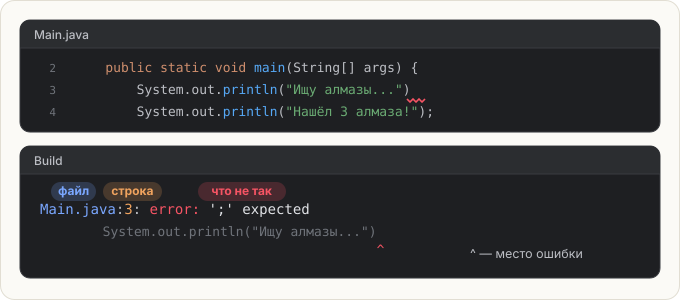

# Читаем ошибки

Ошибки будут всегда — у новичков и у профи. Разница только в том, что профи **читает
сообщение** и чинит за минуту, а не переписывает всё наугад. Научимся с первого урока.

## Где Java сообщает об ошибке

Перед запуском Java **компилирует** программу — переводит текст в команды для машины.
Если в тексте нарушены правила языка, компиляция останавливается, и программа не запускается
вообще, даже правильные строки.

IntelliJ показывает такие ошибки в двух местах:

1. **Прямо в редакторе** — красная волнистая линия под проблемным местом.
   Наведи на неё мышь — всплывёт описание.
2. **В окне Build** внизу — после запуска или **Check**. Там у каждой ошибки есть
   имя файла, номер строки и текст.



## Расшифровка частых ошибок

- `';' expected` — не хватает точки с запятой. **Чини:** поставь `;` в конце команды.
- `package system does not exist` — опечатка в начале команды, Java приняла слово за что-то другое.
  **Чини:** проверь написание и регистр — `System`, а не `system`.
- `cannot find symbol` — Java не знает такого слова. **Чини:** ищи опечатку, например `prinln` вместо `println`.
- `unclosed string literal` — текст не закрыт кавычкой. **Чини:** найди, где потерялась закрывающая `"`.
- `reached end of file while parsing` — не хватает закрывающей `}`. **Чини:** посчитай пары фигурных скобок.

<div class="hint" title="Ошибок много, а строк в коде мало — с какой начинать?">

Всегда **с первой** в списке. Одна настоящая ошибка часто порождает несколько «эхо-ошибок»
ниже: Java запуталась и дальше читает код неправильно. Почини первую и запусти снова —
половина остальных может исчезнуть сама.
</div>

## Задача

В редакторе программа, в которой **три ошибки**. Почини их, ничего не меняя в тексте
внутри кавычек. Программа должна напечатать:

<pre class="k-console">Ищу алмазы...
Нашёл 3 алмаза!
Иду домой</pre>

Порядок работы: нажми **Check** (или запусти программу), прочитай первую ошибку, почини,
повтори.

Не удивляйся, если сначала Java покажет только **две** ошибки, а третья всплывёт, когда
починишь их. Компилятор проверяет программу в несколько проходов, и некоторые ошибки видны
только на следующем.

<div class="hint" title="Где искать — по строкам">

Ошибки в каждой из трёх строк — по одной. Смотри на конец первой строки,
начало второй и кавычки третьей.
</div>

<div class="hint" title="Решение целиком">

```java
System.out.println("Ищу алмазы...");
System.out.println("Нашёл 3 алмаза!");
System.out.println("Иду домой");
```

1. Не хватало `;` в конце первой строки.
2. `system` с маленькой буквы — Java такого не знает.
3. У текста `"Иду домой` не было закрывающей кавычки.
</div>

<script src="../../../lesson-kit/kit.js"></script>
