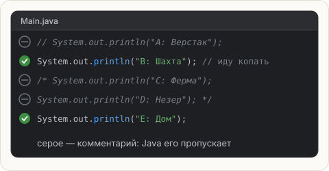

# Комментарии

**Комментарий** — текст в коде, который Java полностью пропускает. Он нужен людям:
тебе через месяц, другу, который будет читать твой мод.

## Два вида

```java
// Однострочный: всё от // до конца строки — комментарий

System.out.println("Привет"); // можно и после команды

/*
   Многострочный: всё между открывающей и закрывающей
   «скобками» — комментарий, сколько бы строк там ни было
*/
```



## Зачем

- **Пояснить, зачем сделано так**, а не что делает строка. `// печатаю привет` над
  `println("Привет")` — бесполезно. `// без пробела, иначе ломается выравнивание таблицы` — полезно.
- **Временно выключить код**, не удаляя его. Это называется «закомментировать».
  В IntelliJ: выдели строки и нажми **Ctrl+/** (на Mac **⌘/**). Повторное нажатие — вернуть.

<div class="hint" title="Можно ли вложить /* */ внутрь /* */?">

Нет. Многострочный комментарий заканчивается на **первом** `*/`. Если внутри уже был
другой `/* ... */`, всё, что после его `*/`, Java снова считает кодом — и, скорее всего,
выдаст ошибку. Поэтому для выключения кода удобнее `//` через **Ctrl+/**.
</div>

## Вопрос

```java
public class Main {
    public static void main(String[] args) {
        // System.out.println("A: Верстак");
        System.out.println("B: Шахта"); // иду копать
        /* System.out.println("C: Ферма");
        System.out.println("D: Незер"); */
        System.out.println("E: Дом");
    }
}
```

**Какие строки напечатает программа?** Отметь все подходящие и нажми **Check**.
Этот код открыт в редакторе — после ответа запусти его.
