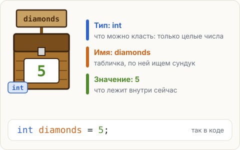

# Переменная — сундук с табличкой

Стив копает шахту. Алмазов у него то 3, то 5, то 12. Программе нужно где-то **помнить** это число
и менять его по ходу игры. Для этого есть <span class="k-term" title="Именованное место в памяти, где программа хранит значение">переменные</span>.



## Три части переменной

Представь сундук с табличкой. На табличке — имя, по нему сундук легко найти. На самом сундуке
пометка, что в него можно класть. А внутри лежит одна вещь — **значение**.

В Java это одна строка. Нажми на любую её часть:

<div class="k-anatomy">
<span class="t-type" data-label="тип" data-explain="<b>int</b> — тип: в этот сундук можно класть только целые числа. От слова integer, «целое число».">int</span>
<span class="t-name" data-label="имя" data-explain="<b>diamonds</b> — имя переменной, табличка на сундуке. Его придумываешь ты. По этому имени программа потом найдёт значение.">diamonds</span>
<span data-label="положи" data-explain="<b>=</b> — «положи в сундук». Это не «равно» из математики, а команда: положи значение справа в переменную слева.">=</span>
<span class="t-value" data-label="значение" data-explain="<b>5</b> — значение: то, что кладём в сундук прямо сейчас. Потом его можно заменить.">5</span>
<span data-label="конец" data-explain="<b>;</b> — конец команды, как в println.">;</span>
</div>

<div class="k-ru">

«Поставь сундук для целых чисел, повесь на него табличку `diamonds` и положи внутрь 5».
</div>

Такая строка называется **объявлением переменной**: ты сообщаешь Java, что теперь есть сундук
с таким именем и таким типом.

## Как достать значение

После объявления переменную зовут **просто по имени**, без типа и без кавычек:

```java
int diamonds = 5;
System.out.println(diamonds);
```

Программа напечатает `5`: Java нашла сундук `diamonds` и показала, что в нём лежит.
Сундук при этом не пустеет, значение остаётся внутри.

Сравни две похожие команды:

- `System.out.println(diamonds);` печатает `5`. Без кавычек это **имя**: Java ищет такой сундук.
- `System.out.println("diamonds");` печатает `diamonds`. В кавычках это **текст**: его печатают как есть.

<div class="k-key">

**Запомни.** Тип пишется один раз — когда сундук ставят. Дальше переменную зовут только по имени.
</div>

## Попробуй

Пример уже лежит в редакторе.

1. Запусти программу: первая строка вывода — `5`, вторая — слово `diamonds`.
2. Поменяй `5` на `64` и запусти снова. Изменится только первая строка.
3. Убери кавычки из второго `println` — получится то же, что в первом.

<script src="../../../lesson-kit/kit.js"></script>
