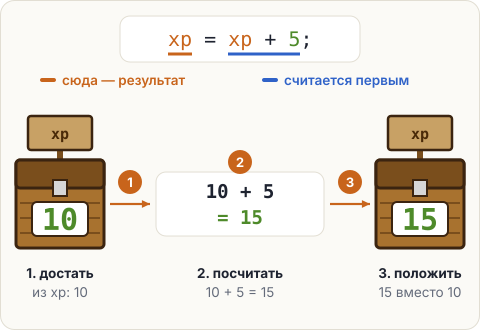

# Новое значение: = значит «положи»

Значение в сундуке можно заменить. Для этого пишут имя, знак `=` и новое значение — **без типа**:
сундук уже стоит, второй ставить не нужно.

```java
int xp = 10;   // поставили сундук xp и положили 10
xp = 3;        // положили 3, а 10 выбросили
```

## Самое странное: xp = xp + 5

В математике `x = x + 5` не имеет смысла. В Java это обычная команда, потому что `=` значит
не «равно», а **«положи»**. Сначала считается правая часть, потом результат кладётся в переменную слева:



Пройди программу по шагам и следи за сундуком:

<div class="k-trace" data-title="Что происходит с xp">
<pre>int xp = 10;
xp = xp + 5;
System.out.println(xp);
xp = 3;
System.out.println(xp);</pre>
<table>
<tr><th>Строка</th><th>int xp</th><th>Экран</th><th>Что происходит</th></tr>
<tr><td>1</td><td>10</td><td></td><td>Ставим сундук <b>xp</b> для целых чисел и кладём в него 10.</td></tr>
<tr><td>2</td><td>15</td><td></td><td>Сначала правая часть: достаём из xp число 10, прибавляем 5 — получается 15. Кладём 15 в xp. Число 10 больше нигде не хранится.</td></tr>
<tr><td>3</td><td>15</td><td>15</td><td>Печатаем то, что лежит в xp. Сундук не пустеет.</td></tr>
<tr><td>4</td><td>3</td><td></td><td>Кладём 3. Старое значение просто выбрасывается — в сундуке всегда ровно одна вещь.</td></tr>
<tr><td>5</td><td>3</td><td>3</td><td>Печатаем: 3.</td></tr>
</table>
</div>

## Короткие записи

Прибавить или отнять от переменной приходится постоянно, поэтому для этого есть сокращения:

| Коротко | То же самое | Что делает |
|---|---|---|
| `xp += 5;` | `xp = xp + 5;` | прибавить 5 |
| `xp -= 2;` | `xp = xp - 2;` | отнять 2 |
| `xp++;` | `xp = xp + 1;` | прибавить 1 |
| `xp--;` | `xp = xp - 1;` | отнять 1 |

<div class="k-trap">

**Ловушка: тип второй раз.** Тип пишут только при объявлении. Если написать его снова, Java решит,
что ставят второй сундук с тем же именем.
</div>

<div class="k-error">
<pre>int xp = 10;
int xp = 15;</pre>
<pre class="k-msg">error: variable xp is already defined in method main(String[])</pre>
<p><b>Перевод:</b> «переменная xp уже объявлена в методе main».</p>
<p><b>Как чинить:</b> во второй строке убрать тип — <code>xp = 15;</code></p>
</div>

## Попробуй

В редакторе пример с `xp` и ещё один — со стрелами. Не запуская, посчитай, сколько стрел
напечатает программа. Потом запусти и сверься.

<script src="../../../lesson-kit/kit.js"></script>
