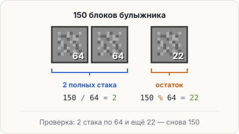

# Умножение, деление и остаток

У Стива 150 блоков булыжника. В один слот инвентаря помещается стак — 64 блока. Сколько слотов
займут полные стаки и сколько блоков останется? Сложения и вычитания из урока 1.2 тут мало:
нужны деление и остаток.



## Три новых знака

- `*` — **умножение**: `2 * 64` даёт `128`. Знака «×» на клавиатуре нет, поэтому звёздочка.
- `/` — **деление**. Для целых чисел оно отвечает на вопрос «сколько раз помещается целиком»:
  `150 / 64` даёт `2`.
- `%` — <span class="k-term" title="Что остаётся после деления нацело: 150 % 64 = 22">остаток от деления</span>:
  `150 % 64` даёт `22`.

```java
int blocks = 150;
System.out.println(blocks / 64);
System.out.println(blocks % 64);
```

<pre class="k-console">2
22</pre>

<div class="k-ru">

«Сколько раз 64 целиком помещается в 150? Два раза — это полные стаки. Сколько блоков остаётся
сверху? 22».
</div>

Проверка: `2 * 64` — это 128, и ещё 22 сверху — снова 150.

Деление целых чисел даёт только целую часть: не 2.34, а 2. Для стаков это ровно то, что нужно:
полных стаков именно два. Почему так и как получить дробь — через пару шагов.

<div class="k-trap">

**Ловушка: % — не проценты.** `150 % 64` — остаток от деления 150 на 64, а не «150 процентов».
</div>

<div class="k-key">

**Запомни.** `/` — сколько раз помещается целиком, `%` — сколько осталось. Вместе они раскладывают
число по стакам.
</div>

## Попробуй

Пример лежит в редакторе. Поменяй 150 на 64, потом на 65 и на 63. Перед каждым запуском
предскажи обе строки: сколько полных стаков и какой остаток.

<script src="../../../lesson-kit/kit.js"></script>
