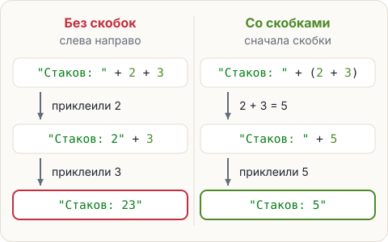

# Порядок действий и скобки

В уроке 1.2 была ловушка: `"Стаков: " + 2 + 3` печатает `Стаков: 23`, а не `Стаков: 5`. И обещание
показать в уроке 1.3, как заставить Java сложить. Пора его выполнить. Сначала — в каком порядке Java считает.

## Порядок — как в математике

1. Сначала то, что в **скобках**.
2. Потом `*`, `/` и `%`.
3. Потом `+` и `-`.
4. Знаки одного уровня — **слева направо**.

```java
System.out.println(2 + 3 * 4);
System.out.println((2 + 3) * 4);
System.out.println(200 / 64 * 64);
```

<pre class="k-console">14
20
192</pre>

<div class="k-ru">

«3 * 4 = 12, плюс 2 — будет 14. Со скобками сначала 2 + 3 = 5, потом 5 * 4 = 20. В третьей
строке знаки одного уровня, поэтому слева направо: 200 / 64 = 3, потом 3 * 64 = 192 —
столько блоков в полных стаках».
</div>

## Скобки чинят склейку



```java
System.out.println("Стаков: " + (2 + 3));
System.out.println("Блоков: " + 2 * 32);
```

<pre class="k-console">Стаков: 5
Блоков: 64</pre>

Во второй строке скобки не нужны: `*` считается раньше `+`, и к тексту приклеивается уже готовое 64.

С минусом так не выйдет: Java сначала склеит текст с 10, а отнять 3 от текста нельзя.

<div class="k-error">
<pre>System.out.println("Осталось: " + 10 - 3);</pre>
<pre class="k-msg">error: bad operand types for binary operator '-'</pre>
<p><b>Перевод:</b> «неподходящие типы для знака <code>-</code>». Слева от минуса получился текст <code>"Осталось: 10"</code>, а из текста число не вычесть.</p>
<p><b>Как чинить:</b> скобки — <code>"Осталось: " + (10 - 3)</code>.</p>
</div>

<div class="k-key">

**Запомни.** Сомневаешься в порядке — ставь скобки. Лишние скобки не мешают, а код с ними читать проще.
</div>

## Попробуй

В редакторе все примеры этого шага. Последняя строка закомментирована: убери `//`, посмотри на ошибку
и почини её скобками.

<script src="../../../lesson-kit/kit.js"></script>
