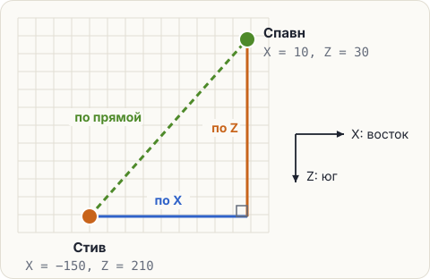

# Задача: далеко ли до спавна

Стив ушёл далеко от точки спавна. Сколько блоков до неё идти? Место в мире задают координаты:
X — запад и восток, Z — север и юг. Высоту Y сейчас не считаем.



## Условие

Координаты уже лежат в переменных — они в редакторе, не меняй их.

1. Посчитай, сколько блоков идти по X и сколько по Z: это разница координат. Расстояние не бывает
   отрицательным — пригодится `Math.abs`.
2. Посчитай расстояние по прямой. Путь по X, путь по Z и прямая — треугольник с прямым углом,
   поэтому работает теорема Пифагора: **по прямой = корень из (по X в квадрате + по Z в квадрате)**.
3. Округли его до целого блока через `Math.round`.
4. Напечатай:

<pre class="k-console">По X: 160
По Z: 180
По прямой: 241</pre>

Числа 160, 180 и 241 считает программа: в коде их быть не должно — ни в вычислениях, ни в тексте
в кавычках.

<div class="hint" title="Как посчитать путь по X">

Вычти одну координату из другой: `playerX - spawnX` — это −160. `Math.abs` уберёт минус:

```java
int dx = Math.abs(playerX - spawnX);
```
</div>

<div class="hint" title="Как записать корень из суммы квадратов">

Квадрат числа — это число, умноженное само на себя: `dx * dx`. Корень — `Math.sqrt(...)`, в скобках
вся сумма: `Math.sqrt(dx * dx + dz * dz)`.
</div>

<div class="hint" title="Получается 240.83… или 240">

`240.8318…` — это корень без округления, оберни его в `Math.round(...)`.
`240` — значит, дробь отрезали через `(int)`, а нужно округлить: 240.83 ближе к 241.
</div>

<div class="hint" title="Ошибка possible lossy conversion from long to int">

`Math.round` даёт `long`. Положи результат в сундук `long`: `long distance = Math.round(...);`
</div>

<div class="hint" title="Решение целиком">

```java
int dx = Math.abs(playerX - spawnX);
int dz = Math.abs(playerZ - spawnZ);
long distance = Math.round(Math.sqrt(dx * dx + dz * dz));
System.out.println("По X: " + dx);
System.out.println("По Z: " + dz);
System.out.println("По прямой: " + distance);
```
</div>

<script src="../../../lesson-kit/kit.js"></script>
