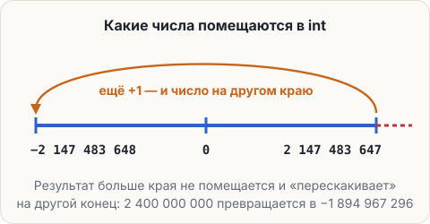

# Когда int мало: переполнение

Сервер работает без перерыва 100 000 игровых дней — это почти четыре года. В игровом дне 24 000 тиков.
Сколько тиков прошло?

```java
int days = 100000;
int ticks = days * 24000;
System.out.println(ticks);
```

<pre class="k-console">-1894967296</pre>

Отрицательное число вместо 2 400 000 000. Ошибки нет — программа просто напечатала ерунду.

## Почему

В сундук `int` помещаются целые числа от −2 147 483 648 до 2 147 483 647 — примерно плюс-минус два миллиарда.
Наш ответ больше. Когда результат не помещается, он «перескакивает» на другой край — это
<span class="k-term" title="Результат не помещается в тип и перескакивает на другой край: после самого большого int идёт самое маленькое">переполнение</span>.
Java о нём не предупреждает.



## Как чинить: long

В уроке 1.2 был тип `long` — для очень больших целых, до 19 цифр. Буква `L` после числа говорит:
«это long». Если в умножении есть хоть один `long`, всё умножение идёт в `long`:

```java
int days = 100000;
long ticks = days * 24000L;
System.out.println(ticks);
```

<pre class="k-console">2400000000</pre>

Если `L` дописать некуда — оба числа в переменных, — помогает приведение типа: `(long) days * 24000`.

<div class="k-trap">

**Ловушка: long слева не спасает.** `long ticks = days * 24000;` всё равно даст минус. Как с делением:
правая часть считается первой, оба числа там `int` — переполнение случается раньше, чем результат
попадает в сундук.
</div>

<div class="k-error">
<pre>long ticks = 2400000000;</pre>
<pre class="k-msg">error: integer number too large</pre>
<p><b>Перевод:</b> «целое число слишком большое». Число без <code>L</code> Java считает <code>int</code>, а для <code>int</code> оно велико — даже если сундук <code>long</code>.</p>
<p><b>Как чинить:</b> дописать <code>L</code> — <code>2400000000L</code>.</p>
</div>

<div class="k-mod">

**В моде пригодится.** В коде Minecraft время мира в тиках хранится в `long` — как раз чтобы счётчик
не переполнился на сервере, который работает годами.
</div>

## Попробуй

В редакторе обе версии. Запусти, потом убери `L` во второй — и снова получишь минус.

<script src="../../../lesson-kit/kit.js"></script>
