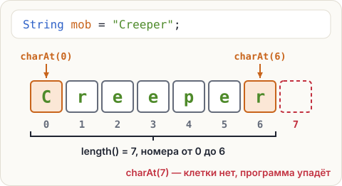

# Строка — ряд клеток с номерами

Ник игрока в Minecraft — от 3 до 16 символов. Чтобы это проверить, программе нужна длина ника.
Чтобы нарисовать значок с первой буквой — нужна первая буква. Как достать это из строки?

## Клетки и номера

Строка — это ряд символов. Каждый символ лежит в своей клетке, а у клетки есть номер —
<span class="k-term" title="Номер клетки с символом. Считается с нуля">индекс</span>.
Номера идут **с нуля**:



## Методы: спроси у строки

У строки есть встроенные команды — <span class="k-term" title="Команда, которую умеет выполнять значение. Пишется через точку: mob.length()">методы</span>.
Их пишут через точку после строки, а в конце — скобки:

```java
String mob = "Creeper";
System.out.println(mob.length());
System.out.println(mob.charAt(0));
System.out.println(mob.charAt(6));
System.out.println(mob.toUpperCase());
```

<pre class="k-console">7
C
r
CREEPER</pre>

- `length()` — сколько символов в строке. Скобки пустые, но писать их обязательно.
- `charAt(номер)` — символ из клетки с этим номером. Это `char`, один символ.
- `toUpperCase()` — та же строка заглавными буквами, `toLowerCase()` — строчными.

Нажми на части вызова:

<div class="k-anatomy">
<span class="t-name" data-label="строка" data-explain="<b>mob</b> — переменная со строкой. У неё и спрашиваем.">mob</span>
<span data-label="у неё" data-explain="<b>.</b> — точка: «у этой строки выполни метод…»">.</span>
<span data-label="метод" data-explain="<b>charAt</b> — метод «символ на месте…» (от английского char at).">charAt</span>
<span class="t-value" data-label="номер" data-explain="<b>(0)</b> — в скобках номер клетки. 0 — самая первая.">(0)</span>
</div>

Похожие вызовы уже встречались: `System.out.println(...)` и `Math.max(...)` из урока 1.3 —
тоже методы. Только метод строки спрашивают **у конкретной строки**: `mob.length()` — длина
именно `mob`.

<div class="k-key">

**Пока просто запомни.** Методы есть у `String`, а у `int`, `double` и других типов с маленькой
буквы — нет. Это то самое отличие `String` из урока 1.2. Почему так — в главе 2, про классы.
</div>

<div class="k-trap">

**Ловушка: последняя клетка.** В `"Creeper"` 7 символов, но последний номер — 6. Последний
символ любой строки — `mob.charAt(mob.length() - 1)`. А `mob.charAt(7)` уронит программу при
запуске: `StringIndexOutOfBoundsException` — «номер за границами строки».
</div>

<div class="k-error">
<pre>String mob = "Creeper";
int letters = mob.length;</pre>
<pre class="k-msg">error: cannot find symbol</pre>
<p><b>Перевод:</b> «не найдено имя». Без скобок Java ищет переменную <code>length</code>, а это метод.</p>
<p><b>Как чинить:</b> у метода всегда скобки — <code>mob.length()</code>.</p>
</div>

## Попробуй

1. Запусти пример. Поменяй `"Creeper"` на свой ник — длина и буквы поменяются сами.
2. Допиши печать последней буквы: `mob.charAt(mob.length() - 1)`.
3. Напечатай `mob.charAt(7)` и посмотри, как программа падает. Потом убери эту строку.

<script src="../../../lesson-kit/kit.js"></script>
