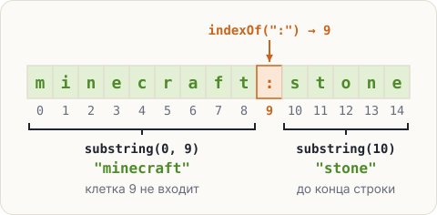

# Найти и вырезать: indexOf и substring

У каждого предмета и блока в Minecraft есть ID, например `minecraft:stone`. До двоеточия —
<span class="k-term" title="Чей это предмет: minecraft — сама игра, ruby_mod — твой мод">пространство имён</span>,
после — <span class="k-term" title="Имя предмета внутри пространства имён">путь</span>.
В твоём моде будет `ruby_mod:ruby`. Как разрезать ID на две части?

## Найти: indexOf

`id.indexOf(":")` ищет двоеточие и возвращает **номер его клетки** (если двоеточий несколько —
первого). Если такого нет — вернёт `-1`.

## Вырезать: substring

- `substring(от, до)` — кусок с клетки `от` до клетки `до`, **не включая** её.
- `substring(от)` — кусок с клетки `от` и до конца строки.



```java
String id = "minecraft:stone";
int colon = id.indexOf(":");
String namespace = id.substring(0, colon);
String path = id.substring(colon + 1);
System.out.println(colon);
System.out.println(namespace);
System.out.println(path);
```

<pre class="k-console">9
minecraft
stone</pre>

<div class="k-ru">

«Найди, в какой клетке двоеточие, — в 9-й. Вырежи всё до него, не включая его, — это `minecraft`.
Вырежи всё с клетки 10 до конца — это `stone`».
</div>

Почему «не включая»? Так удобно: `substring(0, colon)` останавливается ровно перед двоеточием.
И длину куска легко посчитать: `до − от`, то есть 9 − 0 = 9 букв в `minecraft`.

<div class="k-error">
<pre>String id = "minecraft:stone";
char first = id.substring(0, 1);</pre>
<pre class="k-msg">error: incompatible types: String cannot be converted to char</pre>
<p><b>Перевод:</b> «несовместимые типы: String нельзя превратить в char». <code>substring</code> всегда возвращает строку — даже из одного символа.</p>
<p><b>Как чинить:</b> один символ достают методом <code>charAt</code>: <code>char first = id.charAt(0);</code></p>
</div>

<div class="k-mod">

**В моде пригодится.** В коде Minecraft ID хранится в классе `ResourceLocation` — и состоит ровно
из этих двух частей: пространства имён и пути.
</div>

## Попробуй

1. Запусти пример.
2. Поменяй ID на `ruby_mod:ruby`. Программа разрежет и его — двоеточие теперь в другой клетке,
   но `indexOf` найдёт его сам.
3. Напечатай `id.indexOf("#")` — такого символа нет — и посмотри на `-1`.

<script src="../../../lesson-kit/kit.js"></script>
