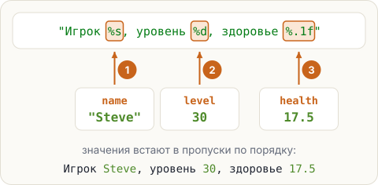

# Шаблон с пропусками: String.format

Табло сервера показывает игроков. Склейкой выходит длинно, и легко потерять пробел:
`"Игрок " + name + ", уровень " + level + ", здоровье " + health`. Удобнее написать **шаблон** —
текст с пропусками — и подставить в него значения.

## Шаблон и пропуски

```java
String name = "Steve";
int level = 30;
double health = 17.5;
String line = String.format("Игрок %s, уровень %d, здоровье %.1f", name, level, health);
System.out.println(line);
```

<pre class="k-console">Игрок Steve, уровень 30, здоровье 17.5</pre>



Пропуск начинается с `%`, а буква после него говорит, что туда встанет:

- `%s` — строка;
- `%d` — целое число;
- `%.1f` — дробное с одной цифрой после точки: `17.5`, `9.0`. А `%.2f` — с двумя.

Значения пишут после шаблона через запятую — **в том же порядке**, что и пропуски.
То же самое короче: `"Игрок %s".formatted(name)` — метод `formatted` у самого шаблона.

## Ширина: ровные колонки

Число между `%` и буквой — ширина. Короткое значение добивается пробелами:
`%-8s` — 8 символов, текст прижат **влево** (минус — «влево»); `%5d` — 5 символов, число прижато вправо.

```java
System.out.println(String.format("%-8s%5d", "Steve", 30));
System.out.println(String.format("%-8s%5d", "Alex", 7));
```

<pre class="k-console">Steve      30
Alex        7</pre>

<div class="k-trap">

**Ловушка: запятая вместо точки.** `%.1f` берёт разделитель из настроек языка компьютера.
На русской системе получится `17,5` — это не ошибка. Проверка задач запускает программу с точкой.
</div>

<div class="k-error" data-javac="skip">
<pre>String.format("%s, уровень %d", name)</pre>
<pre class="k-msg">Exception in thread "main" java.util.MissingFormatArgumentException: Format specifier '%d'</pre>
<p><b>Перевод:</b> «нет значения для пропуска <code>%d</code>». Пропусков два, а значение одно. Программа скомпилировалась, но упала при запуске.</p>
<p><b>Как чинить:</b> сколько пропусков — столько и значений, в том же порядке.</p>
</div>

## Шаблон на несколько строк

Длинный шаблон удобно писать в тройных кавычках — это
<span class="k-term" title="Строка в тройных кавычках &quot;&quot;&quot;: переводы строк внутри сохраняются">текстовый блок</span>:

```java
String card = """
        Игрок: %s
        Уровень: %d
        """.formatted(name, level);
System.out.print(card);
```

Переводы строк внутри блока сохраняются, общий отступ слева Java убирает. Последний перевод
строки уже есть в блоке — поэтому `print`, а не `println`.

## Попробуй

Запусти пример. Поменяй `%.1f` на `%.2f`, а `%-8s` на `%8s` и посмотри, что изменилось.

<script src="../../../lesson-kit/kit.js"></script>
